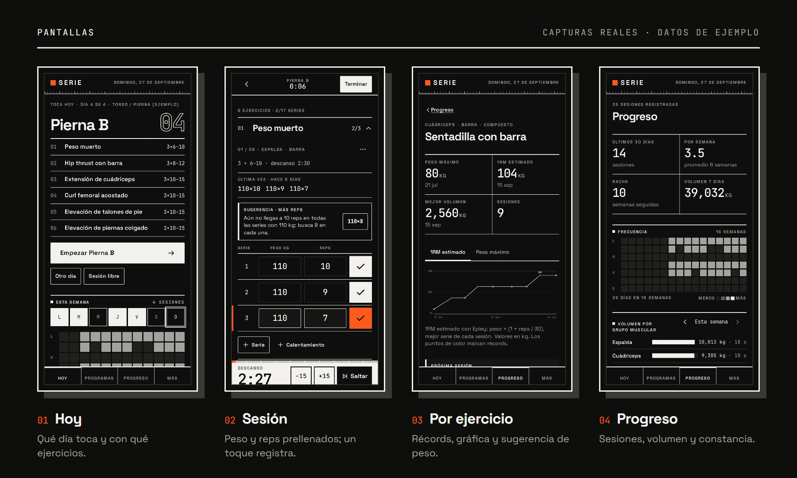
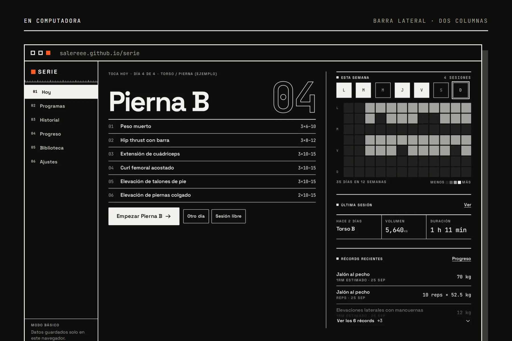

<h1 align="center">
<picture>
  <source media="(prefers-color-scheme: dark)" srcset="docs/img/hero-oscuro.png">
  <source media="(prefers-color-scheme: light)" srcset="docs/img/hero-claro.png">
  
</picture>
</h1>

<p align="center">
  <a href="https://salereee.github.io/serie/"><b>Abrir la app</b></a> ·
  <a href="https://salereee.github.io/serie/inicio/">Página del proyecto</a> ·
  <a href="#correr-en-local">Correr en local</a> ·
  <a href="CHANGELOG.md">Cambios</a>
</p>

<p align="center">
  <a href="https://github.com/Salereee/serie/actions/workflows/pages.yml"></a>
  
  
  
  
  
</p>

# SERIE — registro de rutinas de gimnasio

App web para planear splits y registrar entrenamientos: series, peso, reps, descansos, récords y progreso. **Todo se guarda en tu dispositivo** (IndexedDB): sin cuentas, sin servidor. Se instala como app y funciona sin conexión después de la primera visita.

- Interfaz en español de México, para celular y escritorio.
- Modo básico (cuestionario → split recomendado) y avanzado (constructor, RIR/RPE, supersets).
- Timer de descanso, récords en vivo, sobrecarga progresiva sugerida, gráficas de progreso.

<picture>
  <source media="(prefers-color-scheme: dark)" srcset="docs/img/principios-oscuro.png">
  <source media="(prefers-color-scheme: light)" srcset="docs/img/principios-claro.png">
  
</picture>

## Pantallas

<picture>
  <source media="(prefers-color-scheme: dark)" srcset="docs/img/pantallas-oscuro.png">
  <source media="(prefers-color-scheme: light)" srcset="docs/img/pantallas-claro.png">
  
</picture>

<picture>
  <source media="(prefers-color-scheme: dark)" srcset="docs/img/escritorio-oscuro.png">
  <source media="(prefers-color-scheme: light)" srcset="docs/img/escritorio-claro.png">
  
</picture>

<sub>Capturas reales con los datos de ejemplo de la app (Ajustes → Datos y respaldo). Las imágenes se regeneran con <code>node scripts/readme-visuals.mjs</code>.</sub>

## Requisitos

- Node **22.12 o más reciente** (fijado en `.nvmrc` y en `engines` de `package.json`).
- npm 10+.

## Correr en local

```bash
npm install
npm run dev
```

Abre la URL `Local` que imprime Vite (por defecto <http://localhost:5173>).

### Abrirla desde el celular

`npm run dev` ya expone el servidor en tu red local. Vite imprime algo como:

```
➜  Local:   http://localhost:5173/
➜  Network: http://192.168.1.74:5173/
```

1. Conecta el celular a **la misma red WiFi** que la computadora.
2. Abre la URL `Network` en el navegador del celular.
3. Si no carga, permite Node.js en el firewall (en Windows: “Redes privadas”) y verifica que la red esté marcada como privada.

> En modo desarrollo no hay service worker; la instalación y el modo sin conexión se prueban con `npm run build && npm run preview` o en el sitio publicado.

## Tests y build

| Comando | Qué hace |
| --- | --- |
| `npm test` | Pruebas de lógica: 1RM, progresión, deload, récords, recomendación, migraciones, sesión, respaldo (incluidos archivos malformados), unidades, medianoche |
| `npm run check:contrast` | Verifica contraste WCAG AA de todas las combinaciones de color, en ambos temas |
| `npm run build` | Revisa tipos y genera `dist/` (incluye service worker, manifest, `_headers`, `_redirects`, `robots.txt` y, si aplica, `sitemap.xml`) |
| `npm run build:ci` | `test` + `check:contrast` + `build`. **Es el que usa Cloudflare**: si un test falla, no se publica |
| `npm run preview` | Sirve `dist/` en <http://localhost:4173> (con `--host` para probar en el celular) |
| `npm run icons` | Regenera íconos PWA, `apple-touch-icon`, `favicon.svg` e imagen Open Graph (`og.png`) desde la identidad visual. No genera `favicon.ico`, `favicon-*.png`, `og-en.png` ni las capturas: esos vienen del kit de lanzamiento y se versionan tal cual |

## Despliegue en Cloudflare Pages

### Opción A: conectar el repositorio de GitHub (recomendada)

1. Sube el repo a GitHub.
2. En Cloudflare: **Workers & Pages → Create → Pages → Connect to Git** y elige el repo.
3. Configuración de build:
   - **Framework preset:** None
   - **Build command:** `npm run build:ci`
   - **Build output directory:** `dist`
   - **Variables de entorno:** `NODE_VERSION` = `22` (más las opcionales de [Decisiones de publicación](#decisiones-de-publicación)).
4. Guarda y despliega. Cada push a la rama principal publica; cada pull request genera una vista previa con su propia URL.

### Opción B: subida directa con Wrangler

```bash
npm run build:ci
npx wrangler pages deploy dist --project-name serie
```

La primera vez, Wrangler abre el navegador para iniciar sesión en Cloudflare y crea el proyecto.

### Qué se publica además de la app

- `public/_headers`: CSP estricta (solo recursos propios), `frame-ancestors 'none'`, `nosniff`, `Referrer-Policy`, `Permissions-Policy` (solo *wake lock*; cámara, micrófono y ubicación bloqueados) y cache largo para `/assets/*`.
- `public/_redirects`: **sin reglas** (solo comentarios). Las rutas de la app (`/progreso`, `/historial/…`) funcionan al recargar gracias al modo SPA de Cloudflare Pages: si no hay `404.html` en la raíz (Vite no lo genera), Pages responde `index.html` a cualquier ruta que no sea un archivo. La regla clásica `/* /index.html 200` no se usa: Pages la descarta al publicar (“Infinite loop detected…”) y, si se aplicara, taparía `/inicio/`, porque en `_redirects` “las reglas se siguen aunque exista el archivo”.
- **`/inicio/`: página de presentación** (bilingüe ES/EN) para compartir. Es HTML estático en `public/inicio/` (con su `inicio.css`, `inicio.js`, fuentes e imágenes), sin estilos ni scripts en línea para cumplir la misma CSP estricta. Usa rutas relativas y sus botones “Abrir SERIE” llevan a `../`, así funciona igual en la raíz de un dominio y en `/serie/inicio/` (GitHub Pages). El service worker no la guarda ni la sustituye por la app (`navigateFallbackDenylist`), así que sin conexión no está disponible. En `npm run dev` y `npm run preview` también funciona (`/inicio` redirige a `/inicio/`, como en Pages). Se enlaza desde Ajustes → Acerca de.
- **Íconos y capturas:** `favicon.ico` + `favicon-16/32/48.png` para navegadores sin SVG; `screenshots/` (4 de celular, 2 de escritorio) para la ventana de instalación enriquecida del manifest, que además define accesos directos a Progreso e Historial. Ni las capturas, ni `og.png`/`og-en.png`, ni los favicons PNG, ni `/inicio/` entran al precache del service worker.
- **SEO:** `index.html` lleva `canonical`, `og:url`, `twitter:*` y datos estructurados `WebApplication` (JSON-LD; es un bloque de datos, la CSP no lo bloquea). Con `ALLOW_INDEXING=true` y `VITE_SITE_URL` definida se publican `sitemap.xml` (`/` y `/inicio/`, con la fecha del build) y la línea `Sitemap:` en `robots.txt`. `og-en.png` es la variante en inglés de la imagen para compartir; hoy no la usa ninguna página.

### Rollback

- **Desde el panel:** Workers & Pages → proyecto → **Deployments** → en un despliegue anterior, **⋯ → Rollback to this deployment**. Es inmediato.
- **Desde git:** `git revert <commit>` y push; Cloudflare publica la versión corregida.
- Los usuarios con la app abierta verán “Hay una versión nueva · Actualizar” (nunca durante una sesión activa). Sus datos no se tocan: viven en su dispositivo.

## Despliegue en GitHub Pages

Publicada en **<https://salereee.github.io/serie/>**. La página de presentación del proyecto está en **<https://salereee.github.io/serie/inicio/>**.

El workflow [`.github/workflows/pages.yml`](.github/workflows/pages.yml) corre tests y contraste, compila y publica en cada push a `main` (o a mano desde **Actions → GitHub Pages → Run workflow**). En el repo, **Settings → Pages → Source** debe ser **GitHub Actions**.

GitHub Pages sirve el sitio en una subruta (`/<repo>/`) y no tiene cabeceras propias ni modo SPA, así que el build usa dos variables más:

| Variable | Efecto |
| --- | --- |
| `BASE_PATH` | Subruta de la app (el workflow usa el nombre del repo). Ajusta rutas de assets, router, manifest (`start_url`, `scope`, accesos directos) y el service worker. Vacía = raíz, como en Cloudflare |
| `GITHUB_PAGES=true` | Pone la CSP en una etiqueta `<meta>`, copia `index.html` a `404.html` (así funcionan los enlaces directos como `/serie/progreso`), agrega `.nojekyll` y quita `_headers`/`_redirects` |

Para probarlo en local:

```bash
BASE_PATH=serie GITHUB_PAGES=true npx vite build && BASE_PATH=serie npx vite preview
```

y abre <http://localhost:4173/serie/>.

**Diferencias con Cloudflare Pages:** en GitHub Pages no se pueden enviar cabeceras. Se conserva la CSP (en `<meta>`), pero no aplican `frame-ancestors`/`X-Frame-Options` (el sitio se puede incrustar en un iframe), `Permissions-Policy`, `Cross-Origin-Opener-Policy` ni el control de cache de `sw.js` (GitHub usa 10 minutos, así que una versión nueva puede tardar ese tiempo en detectarse). Los enlaces directos responden con estado 404 aunque la app se abre bien. Los datos de los usuarios son por dominio: los de `salereee.github.io` no se ven en otro dominio (exportar/importar para moverlos).

## Decisiones de publicación

Se controlan con variables de entorno en Cloudflare (**Settings → Variables and Secrets**) o en `.env.production.local`; ninguna es secreta. Ver `.env.example`.

| Variable | Efecto | Por defecto |
| --- | --- | --- |
| `VITE_SITE_URL` | URL pública, sin barra final (p. ej. `https://serie.pages.dev` o tu dominio). Hace absolutas la imagen Open Graph, `canonical`, `og:url` y el JSON-LD de `index.html`, y es requisito del sitemap. **No hay dominio escrito en el código**: todo sale de aquí | vacío: rutas relativas (`canonical` y `og:url` quedan en `/`, válido pero menos útil) y sin sitemap |
| `ALLOW_INDEXING` | `true` = aparece en buscadores (`robots.txt` y meta `robots`). Con `VITE_SITE_URL` además publica `sitemap.xml` y lo anuncia en `robots.txt` | no indexar, sin sitemap |
| `SOURCEMAP` | `true` = publica los source maps | no |
| `VITE_CF_ANALYTICS_TOKEN` | Activa Cloudflare Web Analytics y cambia el aviso de privacidad en “Acerca de”. **Además** hay que cambiar la línea `Content-Security-Policy` de `public/_headers` por la alternativa comentada ahí mismo | sin analítica |

## Limitaciones conocidas

- **Los datos son por dispositivo, por navegador y por dominio.** El celular y la computadora no comparten datos; tampoco `localhost` y el sitio publicado, ni `algo.pages.dev` y un dominio propio. Para mover datos: Ajustes → Exportar / Importar.
- **Sin sincronización ni cuentas**: es a propósito (privacidad), pero implica que si pierdes el dispositivo y no tienes respaldo, pierdes los datos.
- **Safari en iOS puede borrar los datos** de un sitio que no visitas en varias semanas si no está instalado. Instálalo en la pantalla de inicio (la app lo explica) y exporta respaldos.
- **iOS no tiene vibración** en el navegador: el fin del descanso se avisa con sonido y con un destello de pantalla y cambio de color.
- **El sonido** depende de que el teléfono no esté en silencio (iOS) y de haber tocado la pantalla al menos una vez en la sesión.
- El modo incógnito de algunos navegadores bloquea IndexedDB; la app lo detecta y lo explica.
- **`/inicio/` es estático y Vite no lo procesa**: su `canonical` (`/inicio/`) y su `og:image` (`/og.png`) son rutas relativas y no toman `VITE_SITE_URL`. Para vistas previas con imagen al compartir `/inicio/`, cámbialas a mano por URL absolutas cuando tengas el dominio definitivo. Tampoco lleva meta `robots`: con indexación apagada la protege solo `robots.txt`.

## Estructura

```
src/
├─ db/            esquema, Dexie + migraciones, validación de respaldos, seeds, demo, hooks
├─ domain/        lógica pura con pruebas (1RM, progresión, récords, recomendación, unidades…)
├─ features/      pantallas: today, onboarding, programs, session, history, progress, library, settings
├─ pwa/           instalación, aviso de actualización
├─ ui/            primitivos: hoja/diálogo, avisos, error boundary, íconos
├─ hooks/         media queries, reloj, wake lock, audio
└─ styles/        tokens (temas), base, componentes, layout, fuentes
docs/DATOS.md     modelo de datos y cómo agregar migraciones
scripts/          íconos/Open Graph y verificación de contraste
public/inicio/    página de presentación estática (/inicio/)
```

Más detalle del modelo de datos en [`docs/DATOS.md`](docs/DATOS.md). Historial de versiones en [`CHANGELOG.md`](CHANGELOG.md). Pruebas en dispositivos reales en [`PRUEBAS-MANUALES.md`](PRUEBAS-MANUALES.md).

## Stack

Vite + React 18 + TypeScript, Dexie 4 (IndexedDB), React Router 7, @dnd-kit, vite-plugin-pwa (Workbox). Gráficas en SVG propio. Fuentes Space Grotesk y JetBrains Mono autoalojadas (subset latino, woff2).
